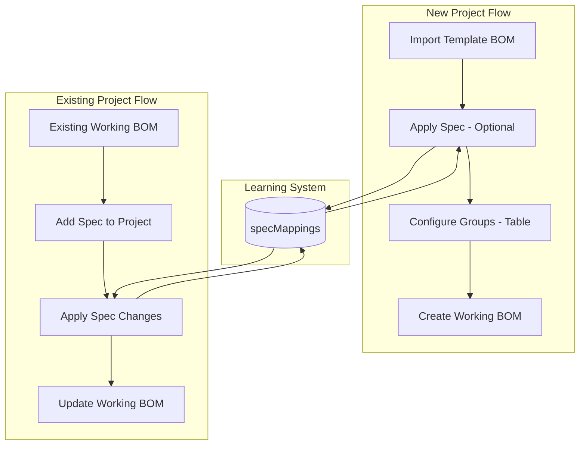

# Phase 15: Spec Management System

**Status**: 📋 Future  
**Estimated Duration**: 3-4 weeks  
**Dependencies**: Phase 14 (Draft PBoM & Collaboration)

---

## Overview

A complete spec management system as an **optional enhancement** to the existing BOM flow. The spec system adds intelligence on top of the current Template BOM → Configure Groups → Working BOM pipeline. Specs can be created independently or attached to projects, and can suggest group selections based on learned mappings.

**Key Principle**: The spec system is optional - the current BOM import and configure flow remains unchanged.

---

## Two Main Use Cases

### Use Case 1: New Project Flow
```
Import Template BOM → [Optional: Apply Spec] → Configure Groups → Create Working BOM
```

### Use Case 2: Existing Project with Working BOM
```
Existing Working BOM → Add Spec → Apply Spec Changes → Update Working BOM
```

Both flows are supported. The spec system is always optional.

---

## Architecture Overview



---

## Detailed Flows

### Flow 1: New Project (Spec Before Working BOM)

1. **Import Template BOM** - Current flow, unchanged
2. **Apply Spec (Optional)** - Map spec options to groups with multi-select
3. **Configure Groups** - Table view with spec suggestions pre-selected
4. **Create Working BOM** - From selected groups

### Flow 2: Existing Project (Spec After Working BOM Exists)

1. **Navigate to Spec tab** - Project already has Working BOM
2. **Add/Import Spec** - Attach spec to project
3. **View Impact Analysis** - Show what groups would change based on spec
4. **Apply Changes** - Add/remove groups from Working BOM based on spec

---

## Spec Changelog (For Ongoing Changes)

When spec is updated on a project:

```
┌─────────────────────────────────────────────────────────────────┐
│ SPEC CHANGELOG                                                  │
├─────────────────────────────────────────────────────────────────┤
│                                                                 │
│ ● Dec 23, 2025 - Spec v2 Applied                    [Applied]  │
│   SPEEDS: 6 Speed → 12 Speed                                   │
│   Added: GDR-1201, GDR-1202 │ Removed: GDR-0601                │
│                                                                 │
│ ● Dec 20, 2025 - Spec v1 Created                    [Applied]  │
│   Initial spec with 12 categories configured                   │
│                                                                 │
│ ○ Dec 24, 2025 - Pending Changes                    [Pending]  │
│   HANDLEBAR: Riser Bar → Straight Bar                          │
│   Impact: +1 group, -1 group                                   │
│   [Review & Apply Changes]                                     │
│                                                                 │
└─────────────────────────────────────────────────────────────────┘
```

---

## Multi-Select Group Mapping

For each spec option, show a multi-select dropdown with all available groups:

```
┌─────────────────────────────────────────────────────────────────┐
│ SPEEDS: 12 Speed                                                │
├─────────────────────────────────────────────────────────────────┤
│ Select groups for this spec option:                             │
│                                                                 │
│ ┌─────────────────────────────────────────────────────────────┐ │
│ │ ☑ GDR-1201  12 Speed Drivetrain        (Suggested - 87%)   │ │
│ │ ☑ GDR-1202  12 Speed Cassette          (Suggested - 87%)   │ │
│ │ ☑ GDR-1203  12 Speed Chain             (Suggested - 87%)   │ │
│ │ ☐ GDR-1204  12 Speed Derailleur                            │ │
│ │ ─────────────── Other Groups ──────────────────────────────│ │
│ │ ☐ GDR-0601  6 Speed Drivetrain                             │ │
│ │ ☐ GDR-1101  11 Speed Drivetrain                            │ │
│ │ ☐ GCR-MISC  Miscellaneous Drivetrain                       │ │
│ └─────────────────────────────────────────────────────────────┘ │
│                                                                 │
│ ℹ️ Your selection will be saved for future projects             │
└─────────────────────────────────────────────────────────────────┘
```

---

## Table-Based Groups View

Enhanced Configure page with table + sidebar filters:

**Table Columns:**
| Select | Group Code | Description | Category | Items | Spec Link | Status |

**Sidebar Filters:**
- Category (checkboxes)
- Spec Category (if spec attached)
- Status: Selected / Available / All
- Search box

---

## Project Spec Page Structure

`/project/[projectId]/spec` with tabs:

| Tab | Purpose |
|-----|---------|
| **Overview** | View current spec, edit, or import new |
| **Apply to BOM** | Map spec options to groups (new project flow) |
| **Changes** | Changelog, apply pending changes (existing BOM flow) |

---

## Firebase Setup

**Collections:**
- `specs/` - Global specs (independent of projects)
- `projects/{projectId}/spec` - Single doc for project's spec
- `projects/{projectId}/specChangelog/` - History of spec changes
- `specMappings/` - Global learning database (bikeType + category + option → groups)

**Indexes:**
```json
{"collectionGroup": "specs", "fields": [
  {"fieldPath": "status", "order": "ASCENDING"},
  {"fieldPath": "createdAt", "order": "DESCENDING"}
]}
{"collectionGroup": "specMappings", "fields": [
  {"fieldPath": "bikeType", "order": "ASCENDING"},
  {"fieldPath": "category", "order": "ASCENDING"}
]}
{"collectionGroup": "specChangelog", "fields": [
  {"fieldPath": "appliedAt", "order": "DESCENDING"}
]}
```

---

## Files Summary

### New Files
| File | Purpose |
|------|---------|
| `types/spec.ts` | Spec, SpecOption, SpecMapping, SpecChange interfaces |
| `lib/spec/specService.ts` | Spec CRUD |
| `lib/spec/specMappingService.ts` | Learning system |
| `lib/spec/specChangelogService.ts` | Track and compute changes |
| `lib/spec/specBomService.ts` | Apply spec changes to Working BOM |
| `lib/hooks/useSpec.ts` | React hook |
| `components/spec/SpecForm.tsx` | Create/edit spec |
| `components/spec/SpecApplyWizard.tsx` | Map spec to groups |
| `components/spec/SpecChangelog.tsx` | Changelog with apply |
| `components/spec/SpecBomImpact.tsx` | Show add/remove groups |
| `components/spec/GroupMultiSelect.tsx` | Multi-select dropdown |
| `components/bom/GroupsTable.tsx` | Table view for groups |
| `components/bom/GroupsFilters.tsx` | Sidebar filters |
| `app/(dashboard)/specs/page.tsx` | Spec overview |
| `app/(dashboard)/specs/new/page.tsx` | Create spec |
| `app/(dashboard)/specs/[specId]/page.tsx` | View/edit spec |
| `app/(dashboard)/project/[projectId]/spec/page.tsx` | Project spec tabs |

### Modified Files
| File | Change |
|------|--------|
| `firestore.indexes.json` | Add spec indexes |
| `firestore.rules` | Add spec rules |
| `components/layout/GlobalSidebar.tsx` | Add Specs link |
| `components/layout/ProjectSidebar.tsx` | Add Spec link |
| `app/(dashboard)/project/[projectId]/configure/page.tsx` | Add table view option |

---

## Implementation Order

1. **Update Documentation** - Replace phase-14-spec-management.md with this plan
2. **Firebase Setup** - Indexes, rules, collections
3. **Types & Services** - spec.ts, all spec services
4. **Groups Table** - GroupsTable, GroupsFilters components
5. **Spec Pages** - /specs CRUD pages
6. **Group Multi-Select** - Dropdown component with learning
7. **Spec Apply Wizard** - For new projects
8. **Spec BOM Impact** - For existing projects with Working BOM
9. **Changelog** - Track and apply changes
10. **Navigation** - Sidebar updates

---

## Success Criteria

- [ ] Can create specs at `/specs` (global)
- [ ] Can attach spec to project at `/project/[id]/spec`
- [ ] Multi-select dropdown maps spec options to groups
- [ ] Mappings learned and suggested on future projects
- [ ] Can apply spec to NEW project (before Working BOM)
- [ ] Can apply spec to EXISTING project (updates Working BOM)
- [ ] Changelog tracks spec changes with apply button
- [ ] Groups table view with sidebar filters
- [ ] Firebase deployed without index errors
- [ ] Existing BOM flow unchanged (no breaking changes)
- [ ] Phase 15 documentation updated
